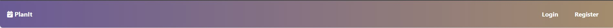
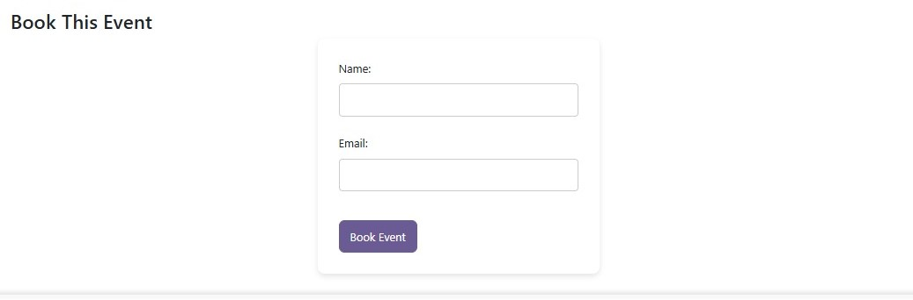
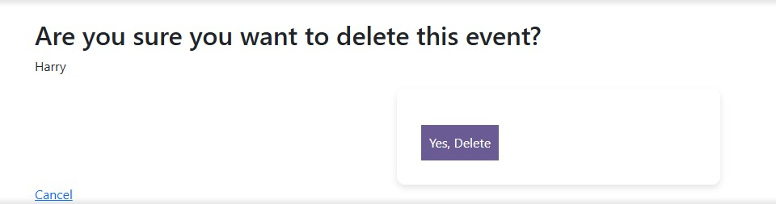
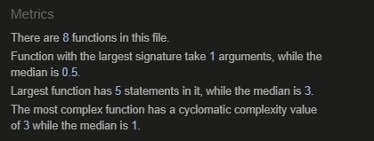

# PlanIt - Event Management Platform

## Live Website

[Deployed PlanIt Application](https://planitbyem-195a427d54d7.herokuapp.com/)

## Project Overview
PlanIt is an intuitive event management platform designed to make creating, managing, and attending events effortless. Whether you're an event organizer planning your next big event or an attendee looking for exciting opportunities, PlanIt simplifies every step of the process.

**For Organizers:**
Create events with comprehensive details like name, description, date, time, location, and category.
Manage your events easily with options to edit, update, or delete them.
Access your personalized "My Events" section to keep track of everything you've created.

**For Attendees:**
Explore a wide variety of events, filtered by name or category.
View detailed event descriptions, dates, and locations.
Seamlessly book your spot at any event with an easy-to-use booking form.
PlanIt features a responsive and user-friendly design that ensures a smooth experience across devices. The platform also prioritizes accessibility and ease of use, with functionalities like:

- Search and Filtering: Quickly find events by keywords or categories using dynamic search functionality.
- Authentication System: Secure login and registration ensure a personalized and safe experience for users.
- Event Management Dashboard: For logged-in users, managing events has never been easier.
- Modern UI/UX Design: A clean, visually appealing interface with interactive elements to enhance user engagement.

Whether you're creating memories or discovering new experiences, PlanIt ensures a seamless and efficient journey for all. 

# Objective

The purpose of this project is to demonstrate my proficiency in Full-Stack web development using Django, HTML, CSS, JavaScript, and Python. The project follows best practices in software development, including Object-Oriented Programming, database management, testing, and deployment.

# Features

## Navbar

A responsive navigation bar that allows users to easily navigate between different sections of the site, including Home, Login, and Register.
## Page Description

This page description helps the users understand the purpose of the page and also gives a brief on all the functions they can use.
 

## Search Section

A search functionality that enables users to filter events by name or category in real-time, providing a seamless browsing experience and also gives a quick access to events.

## Event List

A paginated list displaying available events with essential details like name, description, date, and category, making it easy for users to find and explore events.

## Event Detail

A dedicated page for each event, providing in-depth details, including event description, location, date, and time, along with a booking option.

## Book Event

Users can book available events by providing their name and email, ensuring a simple and streamlined booking process.

## Create Event Page

Allows registered users to create new events by filling out a form with event details.

Update Event: Any changes made to an event are updated in real-time:
- Edit Event: Users who have created the event can modify that event details after creation.
- Delete Event: Users who have created the event can remove their events if necessary.

## Register Page

- New users can create an account to create and manage their events on the page.
- The registration page link is in the navigation bar and at the bottom of the login page.
- To become a member, the user has to enter a username and password.
- If the provided username and password are valid, the user is automatically taken to the login page where they can then enter their credentials to create events.
### Validation

- If the entered username is already taken, the form shows an error message and asks the user to use a different username. 
- After fixing the username and reentering the same password twice, the user can submit the form successfully.

## Login Page

- Registered users can log in to create, edit, and manage their events.
- If an unregistered user wants to create events, they have to log in.
- The user can reach the login page by the link in the navigation bar or through links available throughout the website.
- To log in, the user needs to have their username and password registered on the register page.
- If the username and/or password are incorrect, the page indicates an error.

## Messaging
Upon updating or creating an event a confirmation message pops up.

After you have booked an event, a message will pop up to confirm the name, time and location of the event that is booked along with the name of the one who have booked the event.

If the organizer of the event wishes to delete their event they click the delete button which will take them to a delete confirmation page, that confirm if the organizer wants to delete the page.

## Footer

A simple footer providing copyright information.

## Additional Features for Future Enhancements

- **Categories Section:** A separate section where users can directly browse events by category.
- **Social Sharing:** Users will have the ability to share events via social media platforms.
- **Payment Integration:** Option to include payment processing for paid events.
- **Email Notification:** Send an notification to users on their email id upon booking an event.

## Testing

### Manual Testing
- Ensuring core features function as expected by manually testing event creation, searching, and booking. 
- This is a [List of Manual Tests](manual-testing_md).
- I shared the website with multiple users to confirm its functionality and to get feedback on their experience.

### Automated Testing

- Unit tests will be implemented for critical functionalities such as user authentication, event creation, and booking processes.

### Django Tests
- The Django framework includes a testing library, so no further setup is necessary.
- I started the Django tests with the command `python3 manage.py test`.

### Validation

- **Python:**

    
    
    Code validated using PEP8 to maintain coding standards.

- **HTML:** 
    
   Checked using the W3C HTML validator.

- **CSS:** 
    
   Verified for errors using the W3C CSS validator.

- **JavaScript:** 
    
   Console logs and debugging tools were used to ensure smooth execution.

- **Lighthouse Report:**
  
The website was tested with Google Lighthouse.

## Development Process

Throughout the project, I aimed to follow an agile development approach to ensure flexibility and focus on iterative progress.

### Development Preparation
The initial step in my process was to thoroughly plan the website and its core functionalities. Here’s how I approached it:

- **Class Diagram:**
I began by creating a simple class diagram to outline the models I intended to implement, including their attributes and relationships.
[Link to the class diagram](assets/class_diagram.jpg)

- **User Interface Planning:**
I brainstormed the layout of the website and created [wireframes](assets/Wireframes.jpg) on Balsamiq for key pages like the homepage and event detail page.

- **User Stories and Tasks:**
I wrote a few user stories and tasks at the beginning and continued to develop them as the project progressed. These were documented in my GitHub Project to ensure clarity and organization.

### Agile Development
Using GitHub Projects, I categorized all issues into two milestones:

- "MVP" (Minimum Viable Product): Issues critical for the core functionality of the project.
- "Additional Features": Issues that were not essential for the MVP but could enhance the project if time allowed.

Each issue was labeled as a user story. They were also labled into categories for better organization.

My development workflow followed this structure:

- I selected one issue from the "To-do" column in the MVP board and moved it to the "In Progress" column.
- Once the acceptance criteria for the issue were fulfilled, I closed the issue, which automatically moved it to the "Done" column.
- I have added the user stories that are not necessary for my project at this stage in the "Backlog" column.

### Git Workflow
- Initially, I started the project in Gitpod using the Gitpod Python template provided by Code Institute. Later, I migrated the project to Visual Studio Code (VS Code) for continued development.
- I regularly staged my changes using git add . and committed them to my local repository with git commit -m 'short descriptive message here'.
- Finally, I pushed the commits to the GitHub repository using git push.
- With each push to the main branch, Heroku automatically deployed the latest version of my project to the live application.

This iterative and organized approach helped ensure steady progress and minimized errors throughout the development process.

### Deployment

**Deployment Prepration**

Before the deployment, the following steps were taken to prepare the application for the deployment on Heroku:
- The setting DEBUG in the settings.py was set to FALSE.
- All the dependencies were stored in the requirements.txt file with the command `pip3 freeze --local > requirements.txt`.
- The start command for the application `web: gunicorn event_manage.wsgi` was stored in a Procfile.

**Setup**

The steps to deploy an app to Heroku are as follows:
- Create a new App from the Heroku dashboard.
- Enter a name for the app and select a region, then click on "Create App".
- On the page of the app that opens, go to the "Settings" tab.
- In Settings add the necessary config vars, for this project I added my cloudinary URL, database URL, and django secret key
- Next, add the buildpack "Heroku/Python".
- Afterwards, go to the "Deploy" tab on the app page.
- In the "Deployment method" section, select "GitHub" and follow the steps to connect Heroku with GitHub.
- Then, in the "Connect to GitHub" section, search for the repository that is supposed to be deployed and click on "Connect".
- The last step is to deploy a branch manually by selecting the branch and clicking the button "Deploy Branch" in the "Manual deploys" section.

## Content and Media
- All the articles were either copied from [Eventbrite](https://www.eventbrite.co.uk/) or are made up.
- All the images were downloaded from [Pexels](https://www.pexels.com/).
- All the icons on the website are from [FontAwesome](https://fontawesome.com/).

## Credits & Acknowledgments

- **Code Institute** for guidance and learning resources.
- **Bootstrap & FontAwesome** for styling and icons.
- **Cloudinary** for media file management.
- **Django Documentation** for framework best practices.

---

This project was built as part of the Code Institute Full-Stack Development course.